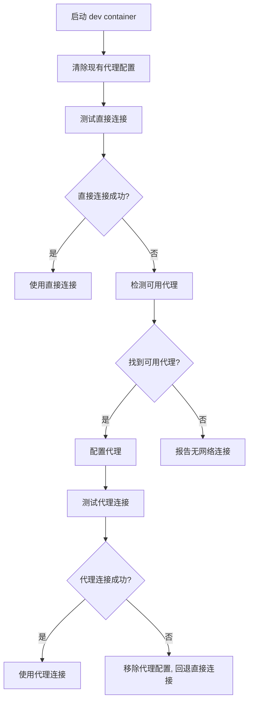

# Git Proxy 配置说明

## 问题描述

在 dev container 环境中，Git 代理配置可能指向容器内的地址（如 `127.0.0.1:10809`），但代理服务实际运行在宿主机上，导致连接失败。

## 解决方案

我们提供了一个智能的 Git 代理配置脚本 `.devcontainer/setup-git-proxy.sh`，它会：

1. **优先尝试直接连接** - 如果可以直接访问 GitHub，则不使用代理
2. **智能检测代理** - 如果直接连接失败，自动检测可用的代理服务器
3. **回退机制** - 如果代理不可用或无效，回退到直接连接

## 工作流程



## 自动集成

脚本已集成到 `devcontainer.json` 的 `onCreateCommand` 中，每次创建容器时自动运行。

## 手动运行

如果需要手动重新配置：

```bash
./.devcontainer/setup-git-proxy.sh
```

## 支持的代理地址

脚本会按顺序检测以下地址：

- `host.docker.internal:10809` (推荐，适用于 Docker Desktop)
- `172.17.0.1:10809`
- `172.18.0.1:10809`
- `172.19.0.1:10809`

## 自定义配置

如果您的代理使用不同的端口，请修改脚本中的 `PROXY_PORT` 变量：

```bash
PROXY_PORT=10809  # 修改为您的代理端口
```

## 故障排除

如果仍然遇到连接问题：

1. 确认宿主机上的代理服务正在运行
2. 检查代理服务是否监听在所有接口（不仅是 127.0.0.1）
3. 验证防火墙设置是否允许容器访问宿主机端口
4. 手动运行脚本查看详细输出

## 网络环境适配

- **直接网络环境**：脚本检测到可以直接访问 GitHub，不会配置任何代理
- **需要代理的环境**：脚本自动检测并配置可用的代理
- **混合环境**：优先使用直接连接，必要时回退到代理
